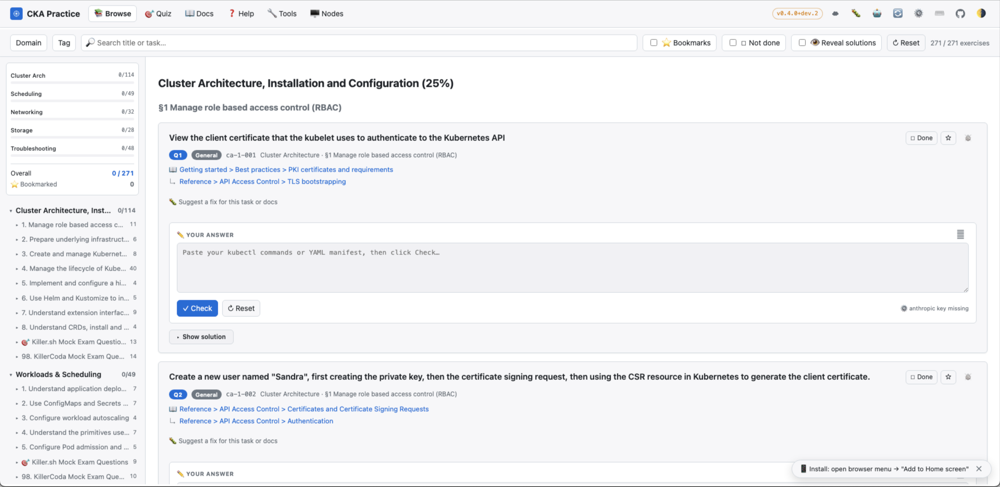
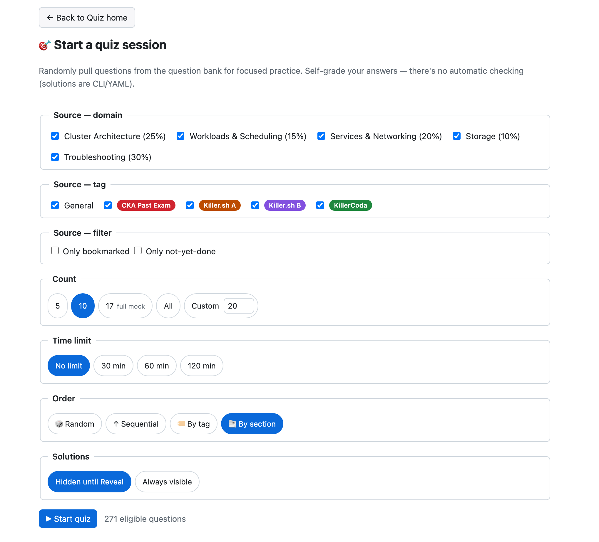
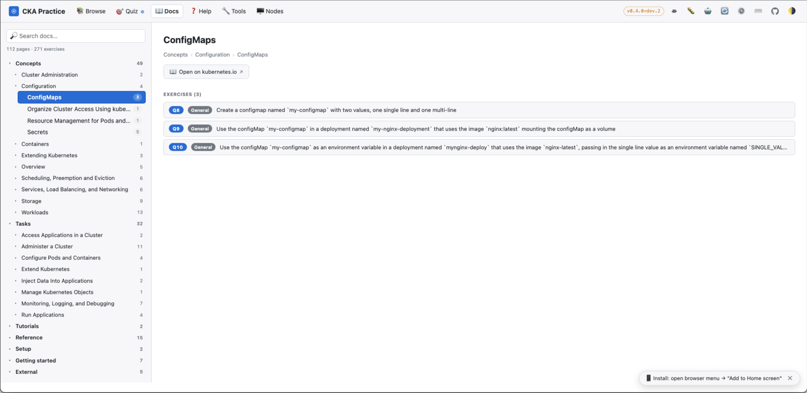
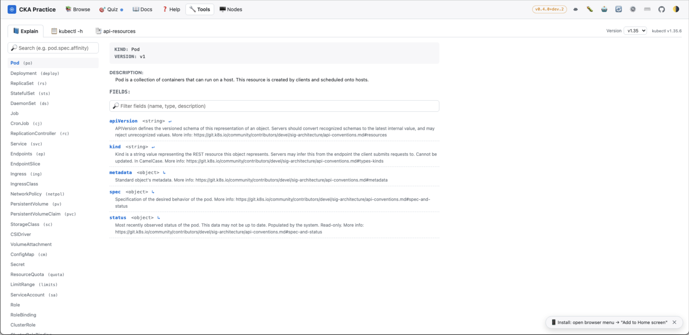

# cka-exercises

[Chinese version](README_CN.md)

A curated CKA (Certified Kubernetes Administrator) practice corpus, collected from the upstream [chadmcrowell/CKA-Exercises](https://github.com/chadmcrowell/CKA-Exercises) repository, the killer.sh Simulator A/B PDFs, the KillerCoda CKA mock-exam PDFs (one per domain), and historical CKA exam questions sourced from study communities. Cleaned, normalized, tagged by source, and exposed in two forms:

- **Markdown files** under [`exercises/`](exercises/) — one file per CKA curriculum domain, ~271 H3 entries total.
- **Static SPA** in [`docs/`](docs/) — searchable browse / quiz / docs-tree practice. Built and deployed via GitHub Actions.

> 👉 **Preparing for the CKA exam?** Start at [`EXAM_GUIDE.md`](EXAM_GUIDE.md) — it's the study index (curriculum, tag scheme, pre-exam dotfiles, sync script, references, other practice resources).

## 🎯 Practice Web App

**Live site:** <https://xooooooooox.github.io/cka-exercises/> · **Usage guide:** [`WEBAPP_GUIDE.md`](WEBAPP_GUIDE.md)

A static SPA in [`docs/`](docs/) gives you searchable browse / quiz / docs-tree practice across all ~271 exercises. Filter by domain, tag (`CKA Past Exam` / `Killer.sh A / B` / `KillerCoda` / general), bookmarks, or undone state. Quiz mode pulls random questions with optional time limits (30 / 60 / 120 min), self-graded scoring, and end-of-session summary. Docs mode mirrors the kubernetes.io navigation hierarchy and reverse-links each page to the exercises that drill it.

GitHub Pages serves `docs/` automatically on push to `main` via [`.github/workflows/build-and-deploy-docs.yml`](.github/workflows/build-and-deploy-docs.yml) (enable in repo Settings → Pages → Source = GitHub Actions).

Progress (✓ Done, ⭐ Bookmark, theme, last-selected docs page) persists in `localStorage`. Markdown is rendered via Marked.js loaded from CDN — no build step at runtime.

## 📸 Screenshots










## Project Structure

```
.
├── CLAUDE.md                           # Claude Code guidance (contributor rules + maintainer ops)
├── README.md / README_CN.md            # this file — engineering README
├── EXAM_GUIDE.md / EXAM_GUIDE_CN.md    # study index for CKA exam takers
├── WEBAPP_GUIDE.md / WEBAPP_GUIDE_CN.md # webapp usage guide
├── CHANGELOG.md                        # all repo changes; also readable in Help mode → 📜 Changelog
├── package.json                        # npm run build / serve / preserve / lint / link-check / release
├── assets/
│   ├── killer-sh/                      # killer.sh Simulator A/B PDFs
│   ├── killercoda/                     # KillerCoda CKA mock exam PDFs (per-domain)
│   └── screenshots/                    # README screenshots (desktop + mobile) — see its own README.md
├── exercises/                          # 5 markdown files, one per curriculum domain
│   ├── cluster-architecture.md         # 25% — 114 exercises
│   ├── scheduling.md                   # 15% —  49 exercises
│   ├── networking.md                   # 20% —  32 exercises
│   ├── storage.md                      # 10% —  28 exercises
│   └── troubleshooting.md              # 30% —  48 exercises
├── docs/                               # GitHub Pages source (the SPA)
│   ├── index.html
│   ├── app.js                          # main SPA entry, no framework
│   ├── sync.js                         # Gist sync engine (PAT + per-key merge state machinery)
│   ├── llm.js                          # LLM-as-judge grading (Anthropic / OpenAI / DeepSeek / Ollama)
│   ├── sw.js                           # service worker source (templated; sw.gen.js is the built artifact)
│   ├── style.css                       # light/dark theme + print
│   ├── manifest.webmanifest            # PWA manifest (installable app icon)
│   ├── icons/                          # PWA icons (180/192/512 PNG + maskable + SVG)
│   ├── exercises.json                  # gitignored — generated artifact (built from exercises/*.md)
│   ├── version.json                    # gitignored — { generatedAt, version, channel, commitsAhead, gitSha }
│   ├── tools-versions.json             # gitignored — Tools manifest (default + per-minor entries)
│   ├── tools-*.json                    # gitignored — per-version Tools bundle
│   ├── nodes-*.json                    # gitignored — per-version Nodes snapshot
│   └── sw.gen.js                       # gitignored — service worker with build version baked in
├── tools/
│   └── nodes/snapshot/                 # source files + versions.json for Nodes mode build
├── scripts/
│   ├── build-exercises.mjs             # MD → exercises.json + version.json (used by CI)
│   ├── build-sw.mjs                    # stamps version into docs/sw.js → docs/sw.gen.js
│   ├── build-tools-bundle.mjs          # orchestrator: per-minor Tools + Nodes bundles
│   ├── build-kubectl-tools.mjs         # low-level: OpenAPI walk + Tools JSON per minor
│   ├── build-kubectl-help.mjs          # low-level: kubectl -h text extraction per minor
│   ├── build-nodes-snapshot.mjs        # Nodes mode: filesystem snapshot per minor
│   ├── lint-exercises.mjs              # exercise-format linter (used by CI)
│   ├── check-links.mjs                 # kubernetes.io URL ping (used by weekly CI)
│   ├── check-curriculum.mjs            # CNCF curriculum PDF drift watcher (used by weekly CI)
│   ├── release.mjs                     # semver bump + CHANGELOG rewrite + tag + GH Release
│   ├── verify-quiz-order.mjs           # ad-hoc verification (quiz ordering invariants)
│   ├── verify-llm-settings.mjs         # ad-hoc verification (LLM settings schema)
│   ├── verify-grader-parse.mjs         # ad-hoc verification (grader parse)
│   ├── apply-enriched-tasks.mjs        # one-shot: killer.sh task-body enrichment
│   ├── apply-killersh-polish.mjs       # one-shot: docs hints + title rewrites
│   ├── apply-killercoda-import.mjs     # one-shot: import KillerCoda PDFs → exercises/*.md
│   ├── k8s-docs-map.json               # kubernetes.io breadcrumb → URL lookup
│   └── answer-fix/                     # aider helpers shared by answer-fix-pr.yml + task-fix-pr.yml
│       ├── extract-context.mjs        # issue body → env + prompt
│       └── h3-range.mjs                # extract / splice a single exercise H3
└── .github/
    ├── answer-fix/prompt.md            # aider prompt for solution-fix issues
    ├── task-fix/prompt.md              # aider prompt for task / docs-fix issues
    └── workflows/
        ├── build-and-deploy-docs.yml   # CI: lint + build + deploy to Pages (push to main)
        ├── lint.yml                    # PR-check: lint exercises markdown
        ├── link-check.yml              # weekly: ping every kubernetes.io URL
        ├── curriculum-watch.yml        # weekly: CNCF curriculum PDF drift watcher
        ├── release.yml                 # manual dispatch: bump version + tag + GH Release
        ├── answer-fix-pr.yml           # manual: answer-fix issue → draft PR (aider)
        ├── task-fix-pr.yml             # manual: task-fix issue → draft PR (aider)
        └── seed-labels.yml             # idempotent label bootstrap (auto on file edit + manual)
```

`build-exercises.mjs`, `build-sw.mjs`, `lint-exercises.mjs`, and `check-links.mjs` run in CI on every push. The three `apply-*.mjs` scripts are idempotent one-shots kept for provenance. `release.yml`, `answer-fix-pr.yml`, `task-fix-pr.yml` are manual-dispatch via the Actions tab. `curriculum-watch.yml` runs weekly via cron and opens a labelled issue when upstream PDFs drift. `seed-labels.yml` runs once on first deploy + whenever its own file is edited, pre-creating the 16 labels both fix workflows + the curriculum watcher expect.

The split between `README.md` (engineering) and `EXAM_GUIDE.md` (study index) is intentional: anyone hitting the repo from a code / contribute angle reads README; anyone landing to study for the CKA exam reads EXAM_GUIDE. Don't move exam-prep content (dotfiles, sync script, practice-lab links, curriculum table) back into README.

## Running Locally

Requires **Node 20+** and Python 3 (for the static file server).

```shell
npm run serve        # auto-builds docs/exercises.json then serves docs/ on :8080
# open http://localhost:8080

npm run build        # just regenerate docs/exercises.json + docs/sw.gen.js
npm run lint         # validate exercises/*.md format
npm run link-check   # ping every kubernetes.io URL (slow — ~106 URLs)
npm run release:dry  # preview the next semver bump from CHANGELOG [Unreleased] (no writes)
```

`docs/exercises.json` is a build artifact regenerated from `exercises/*.md` on every `npm run build` / `npm run serve` and on each Pages deploy. It is gitignored, so it never appears in PRs.

Releases follow [semver](https://semver.org/) (`vX.Y.Z`) and are cut from the Actions UI → **Release** → **Run workflow** (manual dispatch, defaults to auto-inferring the bump from the `[Unreleased]` block in [CHANGELOG.md](CHANGELOG.md)). The release pipeline rewrites the changelog to rename `[Unreleased]` → `[vX.Y.Z] - YYYY-MM-DD`, tags the commit, creates a [GitHub Release](https://github.com/xooooooooox/cka-exercises/releases), and a fresh deploy follows. See `## Release workflow` in [CLAUDE.md](CLAUDE.md) for the full rules.

## CI

Eight GitHub Actions workflows:

- **`build-and-deploy-docs.yml`** — on push to `main`: lint, build `exercises.json` + `sw.gen.js` + per-version Tools / Nodes bundles, deploy `docs/` to Pages.
- **`lint.yml`** — on push to any non-main branch and on PRs: lint + verify the build still works.
- **`link-check.yml`** — weekly Monday cron + manual: pings every kubernetes.io URL referenced by an exercise.
- **`curriculum-watch.yml`** — weekly Monday cron + manual: detects when the upstream CNCF curriculum PDFs drift from baseline; files a labelled issue.
- **`release.yml`** — manual dispatch: bumps `package.json.version`, rewrites `CHANGELOG.md` `[Unreleased]` → `[vX.Y.Z]`, tags, and files a GitHub Release.
- **`answer-fix-pr.yml`** — manual dispatch: takes a `answer-fix`-labelled issue → runs aider against the offending exercise's H3 block → opens a draft PR that closes the issue.
- **`task-fix-pr.yml`** — manual dispatch: same shape as `answer-fix-pr.yml` but for `task-fix`-labelled issues (missing docs links, unclear task wording, etc.).
- **`seed-labels.yml`** — idempotent label bootstrap. Triggers on `workflow_dispatch` and on push to `main` paths-filtered to its own file — so it fires once on first deploy + automatically whenever a new label is added to the seed list, but NOT on routine pushes.

## Contributing

See `CLAUDE.md` for the exercise-file format spec, tag conventions, common-task recipes, and the **append-only ID-stability rule** (don't insert/delete H3 entries in the middle of a section — it silently shifts every subsequent ID and breaks existing users' progress). PRs that touch `exercises/*.md` should be lint-clean (`npm run lint`) before merging.
