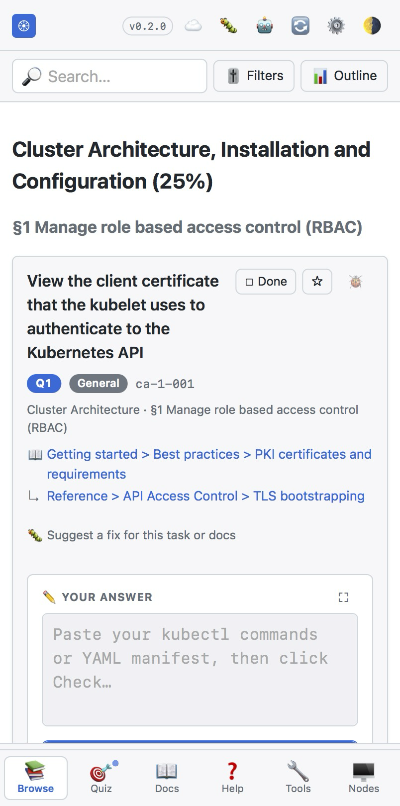
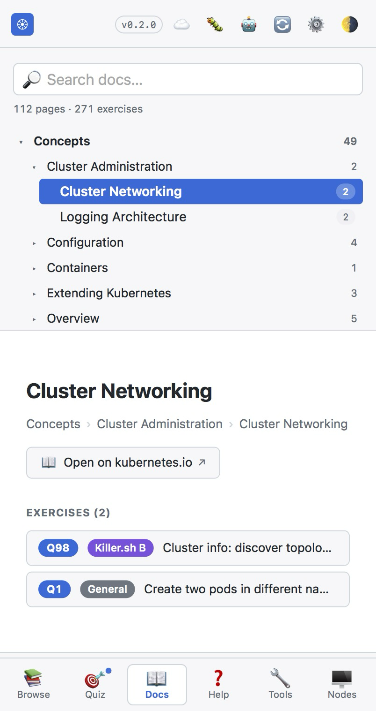

# cka-exercises

[English version](README.md)

整理过的 CKA（Certified Kubernetes Administrator）练习题库，来源于上游 [chadmcrowell/CKA-Exercises](https://github.com/chadmcrowell/CKA-Exercises)、killer.sh Simulator A/B PDF、KillerCoda CKA 模拟考 PDF（每个考点一份），以及社区流传的 CKA 历年真题。清洗、规整、按来源打标签，最终以两种形态呈现：

- **Markdown 文件** —— [`exercises/`](exercises/) 下，每个 CKA 考点一个文件，共 ~271 个 H3 条目。
- **静态 SPA** —— [`docs/`](docs/)，提供浏览 / 测验 / Docs 树 三种模式。通过 GitHub Actions 自动构建并部署。

> 👉 **要备考 CKA 吗？** 从 [`EXAM_GUIDE_CN.md`](EXAM_GUIDE_CN.md) 开始 —— 那是面向考生的备考索引（大纲、标签说明、考前 dotfiles、同步脚本、参考资料、其他练习平台）。

## 🎯 在线练习页面

**在线地址：** <https://xooooooooox.github.io/cka-exercises/> · **使用指南：** [`WEBAPP_GUIDE_CN.md`](WEBAPP_GUIDE_CN.md)

[`docs/`](docs/) 下是一个静态 SPA，提供浏览 / 测验 / 文档树 三种模式，覆盖全部 ~271 道题。支持按考点 / 标签（`CKA Past Exam` / `Killer.sh A / B` / `KillerCoda` / 通用）/ 收藏 / 未完成多维过滤。测验模式可随机抽题、设置 30 / 60 / 120 分钟限时、自我打分、生成会话总结。Docs 模式镜像 kubernetes.io 导航树，每个文档页反向链接关联的题目。

推送到 `main` 后，GitHub Pages 通过 [`.github/workflows/build-and-deploy-docs.yml`](.github/workflows/build-and-deploy-docs.yml) 自动部署（需在仓库 Settings → Pages → Source 选择 GitHub Actions）。

进度（✓ 已完成、⭐ 收藏、主题、Docs 上次选中页）通过 `localStorage` 持久化。Markdown 由 CDN 加载的 Marked.js 渲染，运行时无需构建。

## 📸 截图

### 电脑端


### 手机端

<p align="center">
  
  
  
</p>

## 项目结构

```
.
├── CLAUDE.md                           # Claude Code 的仓库指引（贡献规范 + 维护流程）
├── README.md / README_CN.md            # 本文件 —— 工程 README
├── EXAM_GUIDE.md / EXAM_GUIDE_CN.md    # 面向 CKA 考生的备考索引
├── WEBAPP_GUIDE.md / WEBAPP_GUIDE_CN.md # webapp 使用指南
├── CHANGELOG.md                        # 全部仓库变更；Help mode → 📜 Changelog 内可读
├── package.json                        # npm run build / serve / preserve / lint / link-check / release
├── assets/
│   ├── killer-sh/                      # killer.sh Simulator A/B PDF
│   ├── killercoda/                     # KillerCoda CKA 模拟考 PDF（按 domain 拆分）
│   └── screenshots/                    # README 截图（电脑端 + 手机端）—— 抓图规格见目录下的 README.md
├── exercises/                          # 5 个 markdown，每个 CKA 考点一个文件
│   ├── cluster-architecture.md         # 25% — 114 道题
│   ├── scheduling.md                   # 15% —  49 道题
│   ├── networking.md                   # 20% —  32 道题
│   ├── storage.md                      # 10% —  28 道题
│   └── troubleshooting.md              # 30% —  48 道题
├── docs/                               # GitHub Pages 源目录（SPA）
│   ├── index.html
│   ├── app.js                          # SPA 主入口，无框架
│   ├── sync.js                         # Gist 同步引擎（PAT + per-key merge 状态机）
│   ├── llm.js                          # LLM-as-judge 评分（Anthropic / OpenAI / DeepSeek / Ollama）
│   ├── sw.js                           # service worker 源（sw.gen.js 是构建产物）
│   ├── style.css                       # 浅色 / 深色 + 打印样式
│   ├── manifest.webmanifest            # PWA manifest（可安装的 app 图标）
│   ├── icons/                          # PWA 图标（180/192/512 PNG + maskable + SVG）
│   ├── exercises.json                  # gitignored —— 由 exercises/*.md 构建
│   ├── version.json                    # gitignored —— { generatedAt, version, channel, commitsAhead, gitSha }
│   ├── tools-versions.json             # gitignored —— Tools manifest（默认 + 各 minor 版本）
│   ├── tools-*.json                    # gitignored —— 每个版本的 Tools 数据包
│   ├── nodes-*.json                    # gitignored —— 每个版本的 Nodes 快照
│   └── sw.gen.js                       # gitignored —— 把版本号烤进去的 service worker
├── tools/
│   └── nodes/snapshot/                 # Nodes 模式的源文件 + versions.json
├── scripts/
│   ├── build-exercises.mjs             # MD → exercises.json + version.json（CI 用）
│   ├── build-sw.mjs                    # 把版本号烤进 docs/sw.js → docs/sw.gen.js
│   ├── build-tools-bundle.mjs          # 编排器：各 minor 版本 Tools + Nodes 数据包
│   ├── build-kubectl-tools.mjs         # 底层：OpenAPI walk + 各 minor 版本 Tools JSON
│   ├── build-kubectl-help.mjs          # 底层：各 minor 版本 kubectl -h 文本抽取
│   ├── build-nodes-snapshot.mjs        # Nodes 模式：各 minor 版本文件系统快照
│   ├── lint-exercises.mjs              # exercises 格式 lint（CI 用）
│   ├── check-links.mjs                 # kubernetes.io URL 可达性 ping（周 CI）
│   ├── check-curriculum.mjs            # CNCF curriculum PDF drift watcher（周 CI）
│   ├── release.mjs                     # semver 升版 + CHANGELOG 重写 + tag + GH Release
│   ├── verify-quiz-order.mjs           # 临时校验脚本（quiz 顺序不变性）
│   ├── verify-llm-settings.mjs         # 临时校验脚本（LLM settings schema）
│   ├── verify-grader-parse.mjs         # 临时校验脚本（grader 解析）
│   ├── apply-enriched-tasks.mjs        # 一次性: killer.sh task body 补全
│   ├── apply-killersh-polish.mjs       # 一次性: docs hint + 标题重写
│   ├── apply-killercoda-import.mjs     # 一次性: 把 KillerCoda PDF 导入 exercises/*.md
│   ├── k8s-docs-map.json               # kubernetes.io 面包屑 → URL 查表
│   └── answer-fix/                     # answer-fix-pr.yml + task-fix-pr.yml 共用的 aider 助手
│       ├── extract-context.mjs         # issue 正文 → env + prompt
│       └── h3-range.mjs                # 抽取 / 嵌回单个 H3 块
└── .github/
    ├── answer-fix/prompt.md            # solution-fix issue 的 aider prompt
    ├── task-fix/prompt.md              # task / docs-fix issue 的 aider prompt
    └── workflows/
        ├── build-and-deploy-docs.yml   # CI: lint + build + 部署到 Pages（push to main）
        ├── lint.yml                    # PR 检查: lint exercises markdown
        ├── link-check.yml              # 周: ping 所有 kubernetes.io URL
        ├── curriculum-watch.yml        # 周: CNCF curriculum PDF drift watcher
        ├── release.yml                 # 手动触发: 升版 + tag + GH Release
        ├── answer-fix-pr.yml           # 手动: answer-fix issue → draft PR (aider)
        ├── task-fix-pr.yml             # 手动: task-fix issue → draft PR (aider)
        └── seed-labels.yml             # 幂等 label 引导（文件被编辑 + 手动触发）
```

`build-exercises.mjs` / `build-sw.mjs` / `lint-exercises.mjs` / `check-links.mjs` 在每次 push 都跑 CI。三个 `apply-*.mjs` 是幂等的一次性脚本，保留作为可追溯记录。`release.yml` / `answer-fix-pr.yml` / `task-fix-pr.yml` 是手动触发（Actions tab）。`curriculum-watch.yml` 周 cron 跑，发现上游 PDF drift 时开一个 labelled issue。`seed-labels.yml` 首次部署 + 自身文件被改时自动跑，预创建 16 个 issue label。

`README.md`（工程视角）和 `EXAM_GUIDE.md`（备考索引）的分工是有意为之：从 code / contribute 角度来的人看 README；想备考的人看 EXAM_GUIDE。不要把考试相关内容（dotfiles、sync 脚本、练习实验室链接、考点表）搬回 README。

## 本地运行

要求 **Node 20+** 和 Python 3（用于静态文件服务器）。

```shell
npm run serve        # 自动重新构建 docs/exercises.json 后启动 :8080
# 打开 http://localhost:8080

npm run build        # 重新生成 docs/exercises.json + docs/sw.gen.js
npm run lint         # 校验 exercises/*.md 格式
npm run link-check   # ping 所有 kubernetes.io URL（慢 —— 约 106 个 URL）
npm run release:dry  # 预览下一次 semver bump（不写文件、不 push）
```

`docs/exercises.json` 是 `exercises/*.md` 的构建产物，每次 `npm run build` / `npm run serve` 以及 Pages 部署时自动重生。该文件已 gitignore，不会出现在 PR 中。

版本遵循 [semver](https://semver.org/)（`vX.Y.Z`），通过 Actions UI → **Release** → **Run workflow** 手动触发（默认从 [CHANGELOG.md](CHANGELOG.md) 的 `[Unreleased]` 块自动推断 bump）。release 流水线会把 changelog 的 `[Unreleased]` 改名为 `[vX.Y.Z] - YYYY-MM-DD`、commit、打 tag、创建 [GitHub Release](https://github.com/xooooooooox/cka-exercises/releases)，部署紧随其后。完整规则见 [CLAUDE.md](CLAUDE.md) 的 `## Release workflow` 一节。

## CI

八个 GitHub Actions workflow：

- **`build-and-deploy-docs.yml`** —— `main` 推送时：lint、build `exercises.json` + `sw.gen.js` + 每版本 Tools / Nodes bundle，把 `docs/` 部署到 Pages。
- **`lint.yml`** —— 非 main 分支推送和 PR 时：lint + 验证 build 仍可用。
- **`link-check.yml`** —— 每周一定时 + 手动触发：ping 题目里引用的所有 kubernetes.io URL。
- **`curriculum-watch.yml`** —— 每周一定时 + 手动触发：检测上游 CNCF curriculum PDF 是否漂移，触发时自动开 issue。
- **`release.yml`** —— 手动触发：bump `package.json.version`、改写 `CHANGELOG.md` `[Unreleased]` → `[vX.Y.Z]`、打 tag、创建 GitHub Release。
- **`answer-fix-pr.yml`** —— 手动触发：把指定的 `answer-fix` issue 用 aider 处理一段 H3 → 开 draft PR 关闭该 issue。
- **`task-fix-pr.yml`** —— 手动触发：跟 `answer-fix-pr.yml` 同形态，但处理 `task-fix` issue（缺失的 docs 链接、不清晰的题干等等）。
- **`seed-labels.yml`** —— 幂等的 label 引导。触发条件：`workflow_dispatch` + 推送到 `main` 且路径限定在它自己 —— 首次部署时自动跑一次，之后只在 seed 文件本身被改动（例如新增 `kind/*` 标签）时才再跑，常规 push 不会触发它。

## 贡献

参见 `CLAUDE.md`：题目文件格式规约、标签约定、常见任务套路。改动 `exercises/*.md` 的 PR 合并前需 lint 通过（`npm run lint`）。
